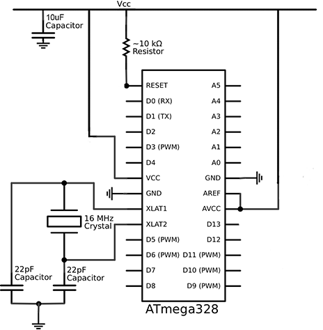
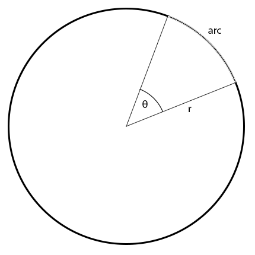
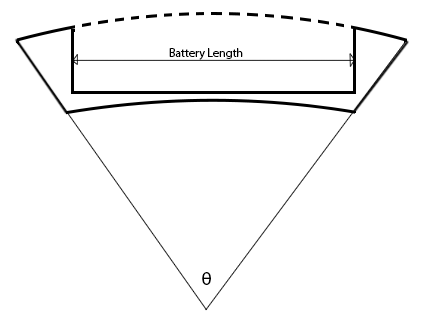

#Led Hoop

##The Hoop
Outer Hoop Diameter : 0.93m (930mm)

Centre Hoop Diameter : 0.912 (912mm)

Inner Hoop Diameter : 0.894m (894mm)

Outer Tube Diameter : 0.018m (18mm)

Inner Tube Diameter : 0.014m (14mm)

##The Leds

W2811 5v RGB addressable Led's

##The IC

##The Power
Lithium Ion TrustFire 14500 

0.054 m x 0.012 m x 0.012 m (54mm x 12mm)

3.5V
###Battery Case

**Arc Length / radius =  θ**

*Arc Length (65mm) = 54mm(battery length) + 11mm (padding)*

0.065m / (0.912m / 2) = 0.1425438596491228 radians (8.16716155 degrees)

##The Code
